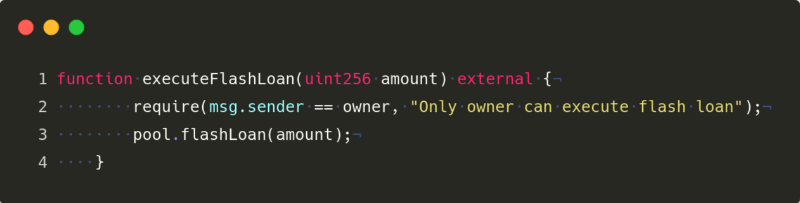
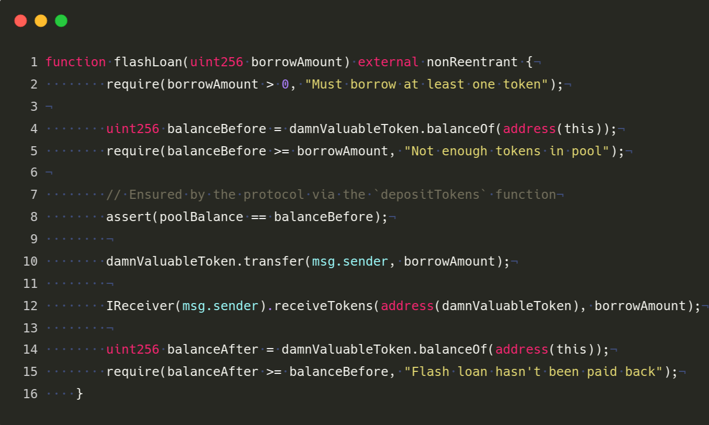

## What are the smart contracts 
- **UnstoppableLender.sol ---> smart contract for give flashloans** 
- **ReceiverUnstoppable.sol ---> recivers smart contract for execute FlashLoan** 
- **DamnValuableToken.sol ---> just an ERC20 Token** 

## What is our mission
There's a lending pool with a million DVT tokens in balance, offering flash loans for free.
We are trying to stop the pool from offering flash loans...

## Solution 

**1. Here reciver triggers flashloan**
  

**2. Here reciver triggers flashloan**
` 

3️ `Get from Carbon ➡️ [Carbon](https://carbon.now.sh/) `

