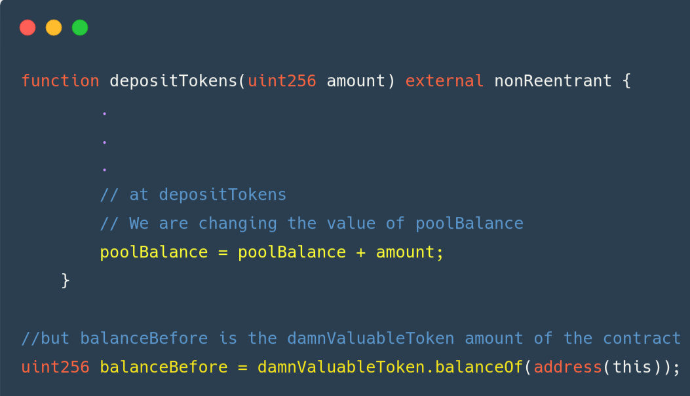
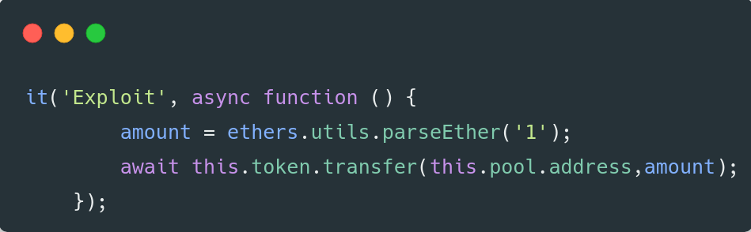

## What are the smart contracts 
- **UnstoppableLender.sol ---> smart contract for give flashloans** 
- **ReceiverUnstoppable.sol ---> receivers smart contract for execute FlashLoan** 
- **DamnValuableToken.sol ---> just an ERC20 Token** 

## What is our mission
There's a lending pool with a million DVT tokens in balance, offering flash loans for free.
We are trying to stop the pool from offering flash loans...

## Solution 

**1. Here receiver triggers flashloan**
  

**2. Here is the flashloan function**
   

**3. The break point is in line 8**
   
   

The contracts check if that **pool Balance** equal to **balance Before** but we can change the value of **pool Balance** with sending DVT to **Unstoppable Lender.sol** and assertion is going to fail.

   
So the solution is put this code to **test/unstoppable/unstoppable.challenge.js** exploit function 

⚠️ **Instead of use  `assert(poolBalance == balanceBefore);`** 
**They should use `assert(poolBalance => balanceBefore);`**  
